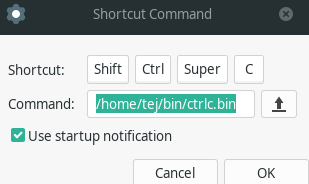

# stack-ctrl-c
Copies a random code block from StackOverflow to the clipboard.

Inspired by:

## How to use

- Create and activate a [Python3 virtual environment](https://stackoverflow.com/a/19848770/)
- Install dependencies with `pip install -r requirements.txt`
- ~~Run `python ctrlc.py`~~
- Compile with `python -m nuitka --onefile --linux-onefile-icon icon.png ctrlc.py`
- Move binary to your bin folder, e.g. `$HOME/bin`
- Run `ctrlc.bin`
  - To speed things up, bind this to a keyboard shortcut in your window manager (see screenshot below for XFCE)!
- Paste with `ctrl+v`!

## Important!
- Needs a clipboard manager. e.g. xsel or xclip on GNU/Linux
- `nuitka` needs `chrpath` to be installed on your system, e.g. `sudo pacman -S chrpath`

## TODO

- [x] Create flow to trigger via keyboard shortcut.
- [x] Package to a distributable binary.

## References

Would not be possible without these gems:

- https://stackoverflow.com/a/24559946/
- https://stackoverflow.com/a/22284921/